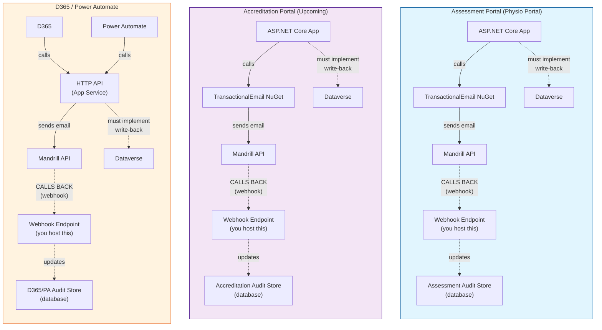
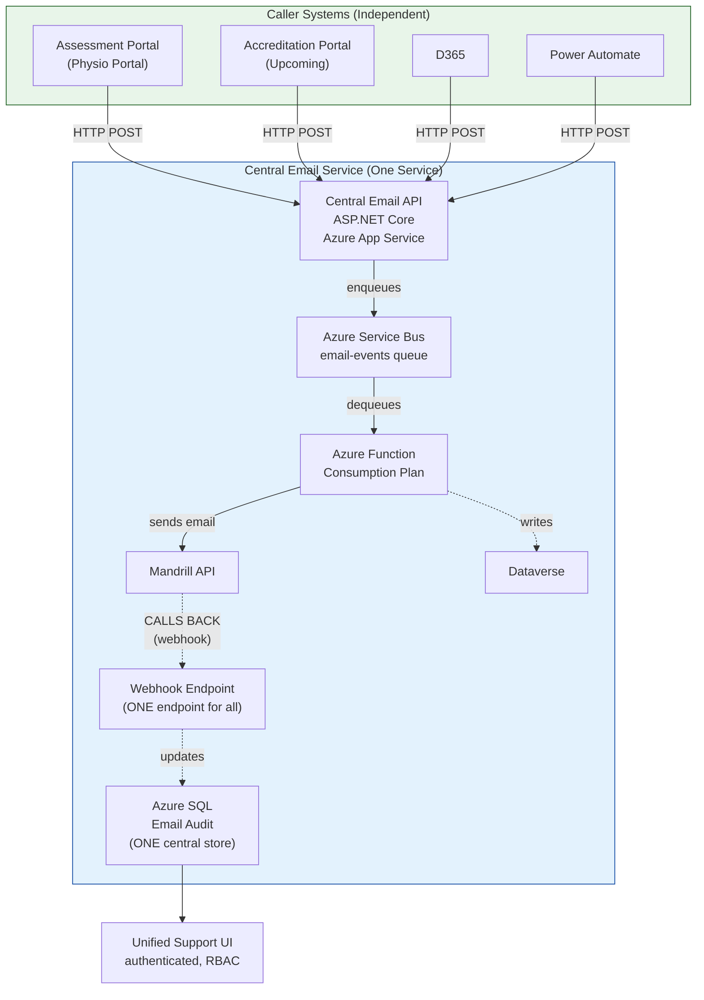
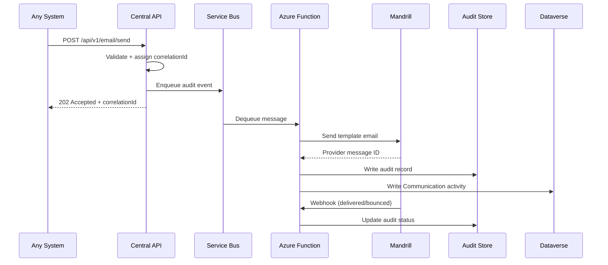
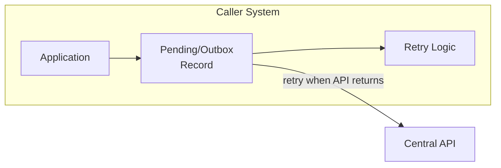
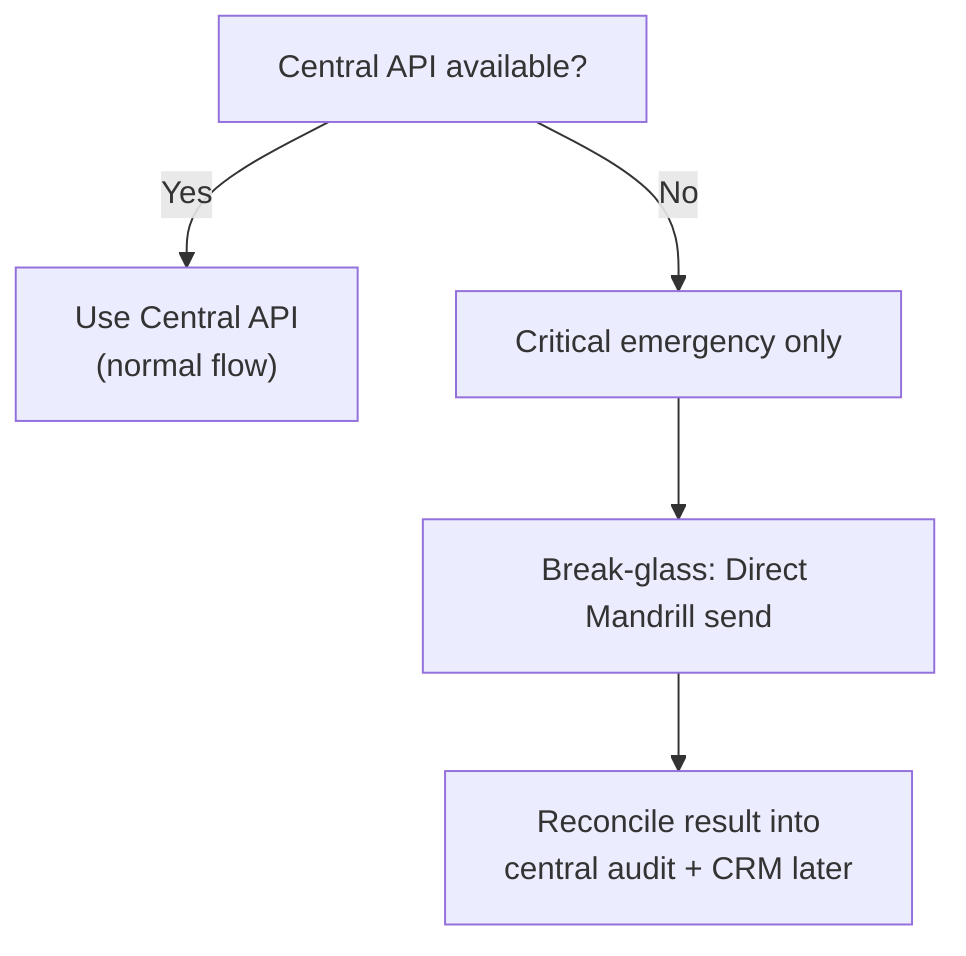

# Email Architecture Comparison: Shared Library vs Central Service

## Executive Summary

This document compares two approaches for integrating Mandrill transactional email into **4 separate, independent systems**: Assessment Portal (Physio Portal), Accreditation Portal (upcoming), D365, and Power Automate.

**Recommendation: Central Email Service** - one HTTP API that all systems call, with Mandrill behind it.

---

## The Four Systems

These are **independent systems** that each need to send transactional emails. They do NOT communicate with each other - they only share Mandrill as the email provider.

| System | Technology |
|---|---|---|
| **Assessment Portal** (Physio Portal) | ASP.NET Core |
| **Accreditation Portal** (upcoming) | ASP.NET Core |
| **D365** | Model-driven app |
| **Power Automate** | Cloud flows |

---

## What is a Webhook?

A webhook is a **callback** - instead of you polling Mandrill for status updates, **Mandrill calls YOU** when something happens.

### How It Works

```
Step 1: You register a webhook URL with Mandrill
        "POST to https://yourapp.com/api/events/mandrill"

Step 2: Mandrill sends an email, it gets delivered

Step 3: Mandrill makes an HTTP POST to YOUR endpoint:
        POST https://yourapp.com/api/events/mandrill
        { "event": "delivered", "email": "user@example.com", "_id": "abc123" }

Step 4: Your endpoint receives it, updates your audit store
```

**Key insight**: The arrow goes FROM Mandrill TO your app. Your app does not call the webhook - Mandrill does.

### Webhook Events

Mandrill sends webhook events for:
- **delivered** - email was delivered to the recipient
- **bounced** - email bounced (invalid address)
- **rejected** - email was rejected by Mandrill
- **opened** - recipient opened the email
- **clicked** - recipient clicked a link in the email

### Why Webhooks Matter

Without webhooks, you would have to **poll** Mandrill constantly to check if emails were delivered. With webhooks, Mandrill **pushes** the status to you in real-time.
### Why Webhooks Matter

Without webhooks, you would have to **poll** Mandrill constantly to check if emails were delivered. With webhooks, Mandrill **pushes** the status to you in real-time.

### The Webhook Broadcasting Problem

**Critical issue**: Mandrill sends ALL webhook events to ALL registered endpoints. This creates a significant problem in the shared library approach.

**In the shared library approach:**
- Assessment registers: `https://assessment.example.com/api/events/mandrill`
- Accreditation registers: `https://accreditation.example.com/api/events/mandrill`
- D365/PA HTTP API registers: `https://d365-pa.example.com/api/events/mandrill`

When Assessment sends an email and it gets delivered:
1. Mandrill fires the webhook event
2. **ALL 3 endpoints receive the same event**
3. Each system must check: "Is this MY email or someone else's?"
4. Each system must filter out events that don't belong to it

**This means duplicated filtering logic in every system.** Each system needs to:
- Receive every webhook event from every system
- Check the provider message ID against its own audit store
- Ignore events that don't belong to it
- Process only its own events

**In the central service approach:**
- Only ONE endpoint is registered: `https://central-api.example.com/api/v1/events/mandrill`
- All events go to ONE handler
- No filtering needed - the central service correlates all events

| Approach | Webhook Endpoints Registered | Filtering Logic Required |
|---|---|---|
| **Shared Library** | 3 (one per system) | Duplicated in each system - each must filter out events from other systems |
| **Central Service** | 1 | None - single handler processes all events |

This is a **major operational burden** in the shared library approach that is completely eliminated by the central service.

---

## Approach 1: Shared Library (Distributed Sending)

### Architecture Diagram



### How It Works

Each system **independently** sends to Mandrill:

1. **Assessment Portal** -> bundles `TransactionalEmail` NuGet -> calls Mandrill directly
2. **Accreditation Portal** -> bundles `TransactionalEmail` NuGet -> calls Mandrill directly
3. **D365** -> calls HTTP API (hosted on App Service) -> calls Mandrill
4. **Power Automate** -> calls HTTP API (same App Service) -> calls Mandrill

Each system has:
- Its **own** Mandrill API key in config
- Its **own** audit store (separate database)
- Its **own** webhook endpoint (that Mandrill calls back)
- Its **own** template mapping configuration
- Its **own** Dataverse write-back logic (must be implemented separately)

### Webhook Flow Detail

For EACH system, the webhook flow is:

```
1. Your app sends email to Mandrill
2. Mandrill delivers email to recipient
3. Mandrill makes HTTP POST to YOUR webhook endpoint:
   POST https://assessment.example.com/api/events/mandrill
   { "event": "delivered", "email": "user@example.com" }
4. Your webhook endpoint validates the request (security)
5. Your webhook endpoint updates your audit store
```

**In the shared library approach, EACH system must implement steps 3-5 independently.**

### The Critical Flaw: D365 and Power Automate Need HTTP

**D365 and Power Automate cannot load a .NET NuGet package.** They need an HTTP endpoint. So the shared library approach **still requires building and hosting an HTTP API** for non-.NET callers.

This means you end up building:
- The shared NuGet library (for Assessment + Accreditation)
- **PLUS** an HTTP API hosted on Azure App Service (for D365 + Power Automate)
- **PLUS** the Mandrill integration in both places

### Where Does the D365/PA HTTP API Sit?

**Yes, it must be hosted on Azure (or similar cloud).** It requires:
- An **Azure App Service** (or Azure Function) to host the HTTP endpoint
- The Mandrill API client code
- Its own audit store
- Its own webhook endpoint
- Its own Dataverse write-back logic

So the shared library approach **does NOT eliminate Azure infrastructure** - it just distributes it differently. You still need to provision and maintain an App Service for the D365/PA HTTP API.

### Dataverse Write-Back

**Important**: The audit store does NOT automatically write to Dataverse. Each application must implement its own Dataverse write-back logic:

```
Assessment Portal -> sends email -> Mandrill delivers -> webhook received
    -> Assessment Portal must create Dataverse Communication activity

Accreditation Portal -> sends email -> Mandrill delivers -> webhook received
    -> Accreditation Portal must create Dataverse Communication activity

D365/PA HTTP API -> sends email -> Mandrill delivers -> webhook received
    -> D365/PA HTTP API must create Dataverse Communication activity

This means Dataverse write-back logic is DUPLICATED across all 3 systems.
```

### Pain Points

| Issue | Impact | Mitigated by Shared DB + Key Vault? |
|---|---|---|
| **Secret Sprawl** | Mandrill API key stored in Assessment, Accreditation, AND the D365/PA HTTP API. Rotation requires updating all 3 places simultaneously. | **Yes** — Key Vault solves this. All systems read from one vault. |
| **Duplicated Audit Stores** | 3 separate audit stores (Assessment DB, Accreditation DB, D365/PA DB). Support must query each one separately to investigate issues. | **Yes** — shared DB solves this. One audit store for all systems. |
| **Template Mapping Duplication** | Template key to Mandrill slug mapping repeated in each system config. Adding a template requires updating all systems. | **Yes** — shared DB table solves this. One template mapping table. |
| **Multiple DB Hits** | Each system queries its own template mapping table. With N systems, that is N separate database connections and queries. | **Partially** — one DB, but still N connections from N systems. |
| **No Central Correlation** | Correlation IDs are local to each system. Tracing a customer journey across systems is impossible without a unified view. | **Partially** — shared DB helps, but each system still generates its own IDs. |
| **Duplicated Webhook Handling** | Assessment, Accreditation, and D365/PA HTTP API each implement Mandrill webhook validation independently. | **No** — each system still needs its own webhook endpoint and validation code. |
| **Webhook Broadcasting** | Mandrill sends ALL events to ALL registered endpoints. Each system must filter out events from other systems - duplicated filtering logic. | **No** — this is a Mandrill behavior. Each endpoint still receives ALL events and must filter. |
| **Duplicated Dataverse Write-Back** | Each system must implement its own logic to create Dataverse Communication activities. | **No** — each system still needs its own Dataverse write-back code. |
| **Version Drift Risk** | NuGet package versions can diverge. Assessment might use Mandrill client v1 while Accreditation uses v2. | **No** — each system references its own NuGet package version. |
| **Unified UI Complexity** | Building a support UI requires aggregating data from ALL 3 databases - cross-DB queries, data transformation, pagination across sources. | **Yes** — shared DB means one query. |
| **Blast Radius of Changes** | A Mandrill API change requires updating and redeploying Assessment, Accreditation, AND the D365/PA HTTP API. | **No** — Mandrill client code is in each system. Changes require updating all 3. |
| **Inconsistent Retry Logic** | Each system implements its own retry policy. Some might retry 3 times, others 5. No consistency. | **No** — each system implements its own retry logic. |
| **Shared DB as New SPOF** | If the shared database goes down, ALL systems fail. | **New risk** — central service can be made HA more easily than a shared DB serving multiple systems. |
| **Shared DB as New SPOF** | If the shared database goes down, ALL systems fail. | **New risk** — central service can be made HA more easily than a shared DB serving multiple systems. |

---

## Counter-Argument: "What if we use a Shared DB + Key Vault?"

A solution architect might say: *"We can use a shared database and Key Vault to reduce duplication in the shared library approach."*

**This is valid** — it reduces SOME pain points. But it does NOT eliminate all of them.

### What Shared DB + Key Vault Solves

| Pain Point | Solved? | How |
|---|---|---|
| Secret Sprawl | **Yes** | All systems read Mandrill key from Key Vault |
| Duplicated Audit Stores | **Yes** | One shared database for all audit records |
| Template Mapping Duplication | **Yes** | One shared table for template key → slug mappings |
| Unified UI Complexity | **Yes** | One database to query for support |
| Multiple DB Hits | **Partially** | One DB, but still N connections from N systems |

### What Shared DB + Key Vault Does NOT Solve

| Pain Point | Still a Problem? | Why |
|---|---|---|
| **Duplicated Webhook Handling** | **Yes** | Each system still needs its own webhook endpoint and validation code |
| **Webhook Broadcasting** | **Yes** | Mandrill sends ALL events to ALL endpoints. Each system still must filter out events from other systems |
| **Duplicated Dataverse Write-Back** | **Yes** | Each system still needs its own code to create Dataverse Communication activities |
| **Version Drift Risk** | **Yes** | Each system references its own NuGet package version. They can diverge. |
| **Blast Radius of Changes** | **Yes** | Mandrill API change requires updating and redeploying all 3 systems |
| **Inconsistent Retry Logic** | **Yes** | Each system implements its own retry policy |
| **Shared DB as New SPOF** | **New risk** | If shared DB goes down, ALL systems fail. Worse than central service because the DB is now a critical dependency for ALL systems. |

### The Shared DB Creates a WORSE Single Point of Failure

**In the shared library approach with shared DB:**
- If the shared database goes down → **ALL 3 systems fail**
- Each system is coupled to the same database schema
- Schema changes require coordinating all 3 systems
- Database performance issues affect all systems

**In the central service approach:**
- The central service owns its own database
- Callers are NOT coupled to the database schema
- The central service can be made HA (multi-instance, auto-healing, deployment slots)
- Database changes are internal to the service — callers unaffected

### Summary

| Aspect | Shared Library + Shared DB + Key Vault | Central Service |
|---|---|---|
| Secrets | Key Vault (one place) | Key Vault (one place) |
| Audit store | Shared DB (one store) | Own DB (one store) |
| Template mapping | Shared table (one place) | Central registry (one place) |
| Webhook handling | 3 implementations | 1 implementation |
| Webhook filtering | 3 filtering logics | No filtering needed |
| Dataverse write-back | 3 implementations | 1 implementation |
| Version drift risk | Still exists | No drift (one codebase) |
| Blast radius | Update 3 systems | Update 1 service |
| Retry consistency | Inconsistent | Consistent |
| SPOF risk | Shared DB affects all | Service can be made HA |
| Coupling | Systems coupled to shared DB | Callers decoupled from DB |

**Bottom line**: Shared DB + Key Vault reduces SOME duplication, but the shared library approach still has duplicated webhook handling, webhook filtering, Dataverse write-back, version drift risk, and inconsistent retry logic. The central service eliminates ALL of these in one go.

### What the Shared Library Gets Right

- **Runtime independence**: If Assessment is down, Accreditation and D365/PA can still send (but this is also true with central service if callers implement an outbox)
- **Simplicity for single-app scenarios**: If you only had ONE .NET app and no D365/PA, a library would suffice

---

## Approach 2: Central Email Service (Recommended)

### Architecture Diagram



### Component Details

| Component | Technology | Responsibility |
|---|---|---|
| **Central Email API** | ASP.NET Core on Azure App Service | Accepts validated email requests, assigns correlation ID, enqueues to Service Bus |
| **Service Bus** | Azure Service Bus Queue `email-events` | Buffers work, enables retry/DLQ, decouples API from worker |
| **Azure Function** | .NET Isolated, Consumption Plan | Processes queue: sends via Mandrill, writes audit, handles webhooks |
| **Audit Store** | Azure SQL (or Table Storage for demo) | Central, searchable record of ALL emails across ALL systems |
| **Support UI** | Authenticated web page/API | Search by recipient, template, source, correlation ID, status |
| **D365 Write-back** | Async via Function | Creates Dataverse Communication activity against Contact |

### Webhook Flow Detail

In the central service, there is only ONE webhook flow:

```
1. Any system sends email via Central API
2. Function sends to Mandrill
3. Mandrill delivers email to recipient
4. Mandrill makes HTTP POST to the ONE webhook endpoint:
   POST https://central-api.example.com/api/v1/events/mandrill
   { "event": "delivered", "email": "user@example.com" }
5. Webhook endpoint validates the request (security)
6. Webhook endpoint updates the ONE central audit store
7. Function writes Dataverse Communication activity (ONE place)

All webhook handling is in ONE place. No duplication.
```

### Data Flow (End-to-End)



### How Issues Are Addressed

| Concern | How Central Service Solves It |
|---|---|
| **Secret Management** | Mandrill key stored ONCE in central API config (or Key Vault). Callers never see it. |
| **Unified Audit** | All systems write to ONE audit store. Support searches one place. |
| **Central Correlation** | Correlation ID assigned at API level, flows through entire pipeline. |
| **Single Webhook Handler** | ONE endpoint receives Mandrill webhooks, correlates using provider message ID. |
| **Single Dataverse Write-Back** | ONE function writes to Dataverse. No duplication. |
| **Template Mapping** | Central registry. Add a template once, all systems can use it immediately. |
| **Single DB Hit** | One query to one audit store. No cross-DB aggregation needed. |
| **Unified UI** | One data source = simple queries. Search, filter, export from one place. |
| **Consistent Retry** | Service Bus retry policy + DLQ. Same behavior for all callers. |
| **D365/PA Integration** | HTTP API is the native integration point. No adapter needed. |
| **Blast Radius** | Mandrill changes affect ONE service. Callers are unaffected. |
| **Scalability** | API, Function, and SQL scale independently. Queue absorbs load spikes. |

---

## Comparison Matrix

*Note: "Shared Library (optimized)" assumes shared DB + Key Vault to reduce duplication.*

| Criteria | Shared Library (basic) | Shared Library (optimized with Shared DB + Key Vault) | Central Service | Winner |
|---|---|---|---|---|
| **Initial setup complexity** | Low | Medium (shared DB + KV setup) | Medium | Shared Library |
| **D365/PA support** | Needs separate HTTP API | Needs separate HTTP API | Native HTTP API | **Central Service** |
| **Secret management** | Key in 3 places | Key Vault (one place) | Key Vault (one place) | Tie |
| **Audit unification** | 3 separate stores | Shared DB (one store) | One store | Tie |
| **Correlation tracking** | Local only | Local (shared DB helps slightly) | End-to-end | **Central Service** |
| **Webhook handling** | 3 implementations | 3 implementations (not solved by DB+KV) | One implementation | **Central Service** |
| **Webhook broadcasting** | Each filters ALL events | Each filters ALL events (not solved) | Single endpoint, no filtering | **Central Service** |
| **Dataverse write-back** | 3 implementations | 3 implementations (not solved) | One implementation | **Central Service** |
| **Template management** | Duplicated | Shared table (one place) | Central registry | Tie |
| **Support UI complexity** | Cross-DB aggregation | Single query | Single query | Tie |
| **Operational overhead** | High (3 things) | Medium (3 things, shared DB) | Low (one service) | **Central Service** |
| **Runtime independence** | Systems independent | Systems coupled to shared DB | API is single dependency | Shared Library |
| **Retry consistency** | Inconsistent | Inconsistent (not solved) | Consistent via Service Bus | **Central Service** |
| **Version drift risk** | High risk | High risk (not solved) | No drift (one codebase) | **Central Service** |
| **Blast radius** | Update 3 systems | Update 3 systems (not solved) | Update 1 service | **Central Service** |
| **Cost** | 3 DBs + 3 endpoints | 1 DB + 3 endpoints | 1 DB + 1 endpoint | **Central Service** |
| **Vendor lock-in** | 3 integrations | 3 integrations | 1 integration | **Central Service** |
| **SPOF risk** | Each system independent | Shared DB affects all | Service can be made HA | **Central Service** |

---

## Cost Comparison

### Shared Library (Monthly, Production Estimate)

| Component | Qty | Cost Each | Total |
|---|---|---|---|
| Assessment audit DB (Basic SQL) | 1 | ~$5/mo | ~$5/mo |
| Accreditation audit DB (Basic SQL) | 1 | ~$5/mo | ~$5/mo |
| D365/PA HTTP API (App Service B1) | 1 | ~$13/mo | ~$13/mo |
| D365/PA audit DB (Basic SQL) | 1 | ~$5/mo | ~$5/mo |
| Monitoring (App Insights) | 3 | ~$2/mo | ~$6/mo |
| **Total** | | | **~$34/mo** |

### Central Service (Monthly, Production Estimate)

| Component | Qty | Cost Each | Total |
|---|---|---|---|
| App Service (API) | 1 | ~$13/mo | ~$13/mo |
| Function App | 1 | ~$0 (consumption) | ~$0-5/mo |
| Service Bus (Basic) | 1 | ~$0.05/1M ops | ~$0-1/mo |
| SQL Database (Basic) | 1 | ~$5/mo | ~$5/mo |
| Storage | 1 | ~$0.02/mo | ~$0.02/mo |
| App Insights | 1 | ~$2/mo | ~$2/mo |
| **Total** | | | **~$20-26/mo** |

**Central service costs ~25-40% less** at production scale.

---

## Addressing the Single Point of Failure Concern

### The Solution Architect Argument

> "If the central email service goes down, ALL systems cannot send emails. With the shared library approach, if one system goes down, the others continue to function."

### Why This Argument is Flawed

**You are mixing two different things:**

1. **If Mandrill goes down** -> ALL systems fail in BOTH approaches. Period. There is no workaround - if the email provider is down, no one can send email.

2. **If one caller system goes down** (e.g., Assessment Portal has an issue):
   - In shared library: Assessment cannot send (it is down), but Accreditation and D365/PA can
   - In central service: Assessment cannot send (it is down), but Accreditation and D365/PA can
   - **Same outcome** - the down system has the issue, not the email platform

3. **If the central email service goes down**:
   - This is equivalent to Mandrill going down - all systems are affected equally
   - In shared library, if Mandrill goes down, all systems are ALSO affected equally
   - **Same outcome** - the email platform is down, no one can send

### The Real Question: How to Make the Central Service Resilient

The central service is a **single service that can be made highly available**. Here is how:

#### 1. Caller-Side Outbox Pattern (Primary Defense)



Each caller writes to a pending/outbox record BEFORE calling the API. If the API is down:
- The pending record stays in the caller database
- Retry logic attempts to send when the API recovers
- No email request is lost

**This is the same pattern used in the shared library approach for reliability.**

#### 2. Multiple Instances + Load Balancer

Azure App Service supports multiple instances behind a load balancer:
- If one instance fails, others handle traffic
- Auto-healing replaces unhealthy instances
- Deploy across availability zones for zone redundancy

#### 3. Service Bus Durability

Messages queued in Service Bus **persist** even if the API is temporarily down:
- Messages wait in the queue until a worker picks them up
- Built-in retry policy (e.g., retry 3 times with delays)
- Dead-letter queue for messages that fail all retries

#### 4. Break-Glass Fallback (Emergency Only)



For critical systems (e.g., emergency communications), have a backup direct Mandrill path:
- Only used when central service is confirmed down
- Results are reconciled into central audit when service recovers
- This is an **exception handler**, not the normal flow

#### 5. Health Monitoring + Auto-Recovery

- Application Insights monitors API health
- Azure auto-healing restarts unhealthy instances
- Alerts notify operations team of issues
- Deployment slots enable zero-downtime updates

### Why Central Service is Actually MORE Resilient

| Scenario | Shared Library | Central Service |
|---|---|---|
| **Mandrill down** | All systems fail | All systems fail |
| **Assessment down** | Assessment fails, others OK | Assessment fails, others OK |
| **Central service down** | N/A | All systems affected (same as Mandrill down) |
| **Assessment NuGet bug** | Assessment fails, others OK | Assessment unaffected (bug is in central service) |
| **Mandrill API change** | Update 3 systems, redeploy all | Update 1 service, callers unaffected |

**Key insight**: In the shared library approach, a bug in the NuGet code affects each system independently. In the central service approach, the service is ONE thing to monitor, maintain, and make highly available. You can apply enterprise-grade HA patterns (multi-instance, auto-healing, deployment slots) to ONE service instead of hoping each system implements them correctly.

---

## Why the Central Service is Superior

### 1. D365/Power Automate Force the Issue

The shared library approach **cannot serve D365 or Power Automate** - they need HTTP. So you end up building both a NuGet library AND an HTTP API, with Mandrill integration in both. The central service HTTP API is the integration point for everyone.

### 2. The "Moving Parts" Problem

Shared library for 4 systems:
- 3 Mandrill credential configs (Assessment, Accreditation, D365/PA HTTP API)
- 3 audit databases
- 3 webhook endpoints registered with Mandrill (ALL receive ALL events)
- 3 webhook filtering implementations (each must filter out other systems' events)
- 3 Dataverse write-back implementations
- 3 template mapping configs
- 3 retry policies
- 3 monitoring setups
- N support UI data sources

Central service:
- 1 of each (no filtering needed)

### 3. The Unified Support UI

With shared library, building a support UI that answers "what happened to this email?" requires:
- Querying Assessment DB
- Querying Accreditation DB
- Querying D365/PA DB
- Merging results from 3 different sources
- Handling different schemas

With central service: **one query to one store**.

### 4. Correlation ID Flow

In the central service, the correlation ID flows through the entire pipeline:
```
Caller -> API (assigns correlationId) -> Service Bus -> Function -> Mandrill -> Webhook -> Audit -> CRM
```

With shared library, correlation IDs are local to each system. There is no way to trace a customer journey that spans Assessment -> D365 -> Accreditation.

---

## Demo: What We Built

### Shared Library Host (Port 5090)
- Simulates the Assessment Portal bundling the Mandrill library
- Has its own audit store (in-memory for demo - **in production this would be a separate DB per app**)
- Has its own webhook endpoint
- Shows ONLY Assessment emails in its UI
- **Run**: `dotnet run --project email-shared-library-host/src/SharedLibrary.Host`

### Central Service (Port 5080)
- One HTTP API for all systems
- Service Bus integration for async processing
- Central audit store (in-memory for demo - **in production this would be Azure SQL**)
- Unified support UI showing ALL systems
- **Run**: `dotnet run --project email-central-service/src/CentralApi`

### Running Both Locally

```powershell
# Terminal 1: Shared Library (Assessment app)
dotnet run --project email-shared-library-host/src/SharedLibrary.Host

# Terminal 2: Central Service
dotnet run --project email-central-service/src/CentralApi
```

Then use the respective `demo.http` files with VS Code REST Client.

---

## Production Deployment (Azure)

### Resources Needed

| Resource | Purpose | Free Tier Available |
|---|---|---|
| Azure App Service (F1) | Host central API | Yes (F1) |
| Azure Service Bus (Basic) | Queue for async processing | No (Basic ~$0.05/1M) |
| Azure Function (Consumption) | Process queue, handle webhooks | Yes (1M free/month) |
| Azure SQL (Basic) | Audit store | No (Basic ~$5/mo) |
| Storage Account (LRS) | Archive, terraform state | Yes (1GB free) |
| Application Insights | Monitoring | Yes (5GB free) |

### Terraform

Full Infrastructure-as-Code is provided in each project `infra/` folder.

---

## Conclusion

The central email service is the superior architecture because:

1. **It is the only approach that serves ALL systems** (including D365/PA)
2. **It centralizes what should be centralized** (provider integration, audit, webhooks)
3. **It costs less** (one of each resource vs. three of each)
4. **It is simpler to operate** (one service to monitor, update, and debug)
5. **It enables features impossible with shared library** (unified support UI, end-to-end correlation, consistent retry)
6. **It can be made highly available** (multi-instance, auto-healing, outbox pattern, break-glass fallback)

The shared library approach seems simpler initially but creates a distributed system where every application owns part of the email platform - and you still need an HTTP API for D365/Power Automate anyway.
