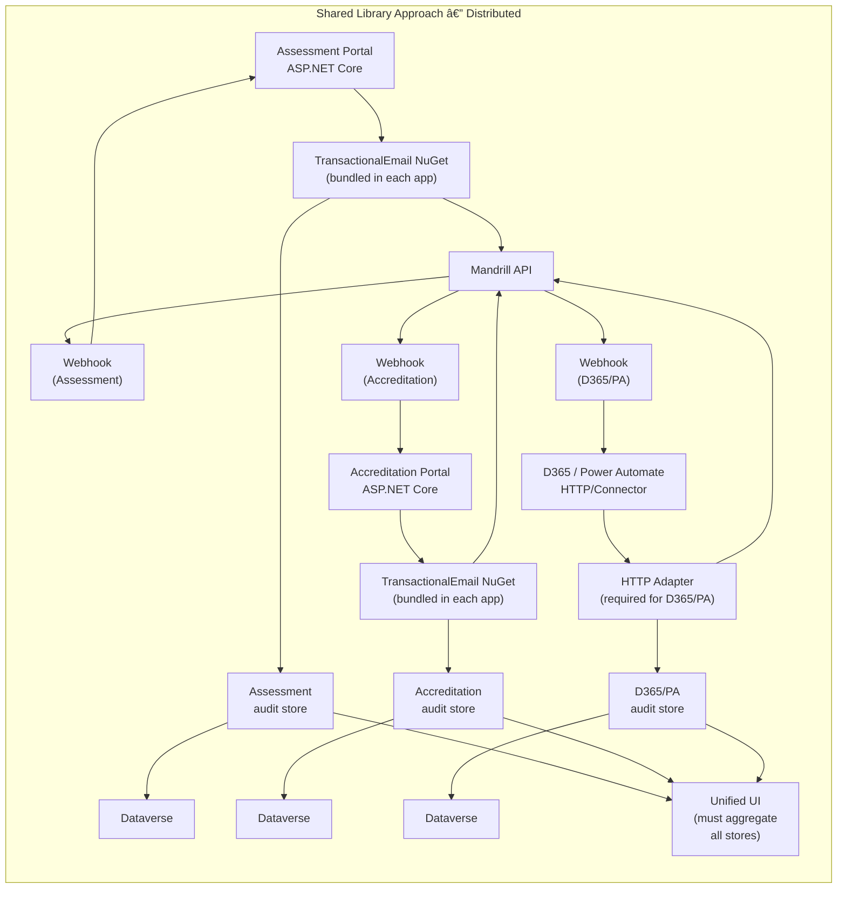
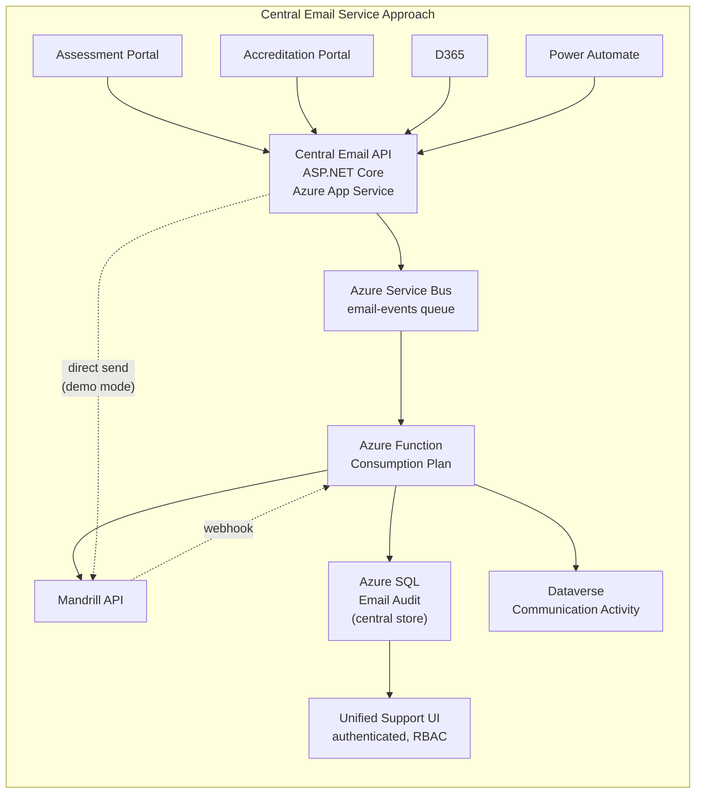
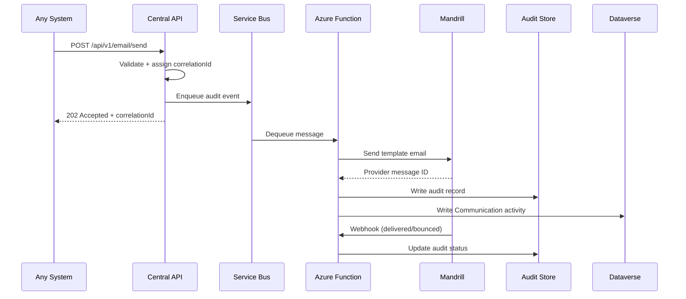

# Email Architecture Comparison: Shared Library vs Central Service

## Executive Summary

This document compares two approaches for integrating Mandrill transactional email into organization applications (Assessment Portal, Accreditation Portal, D365, Power Automate).

**Recommendation: Central Email Service** — one HTTP API that all systems call, with Mandrill behind it.

---

## Approach 1: Shared Library (Distributed Sending)

### Architecture Diagram



### How It Works

Each .NET application bundles a **NuGet package** (`TransactionalEmail`) that:
1. Contains the Mandrill API client
2. Reads Mandrill credentials from its own config
3. Sends emails directly to Mandrill
4. Writes to its own audit store
5. Handles Mandrill webhooks independently

### The Critical Flaw: D365 and Power Automate Cannot Use a .NET Library

**D365 and Power Automate cannot load a .NET NuGet package.** They need an HTTP endpoint. So the shared library approach **still requires building an HTTP API** for non-.NET callers.

This means you end up building:
- The shared NuGet library (for .NET apps)
- **PLUS** an HTTP API (for D365/PA)
- **PLUS** the Mandrill integration in both places

### Pain Points

| Issue | Impact |
|---|---|
| **Secret Sprawl** | Mandrill API key stored in EVERY application's config. Rotation requires updating all apps simultaneously. |
| **Duplicated Audit Stores** | Each app has its own audit database/table. Support must query each one separately to investigate issues. |
| **No Central Correlation** | Correlation IDs are local to each app. Tracing a customer journey across systems is impossible without a unified view. |
| **Duplicated Webhook Handling** | Each app must implement Mandrill webhook validation and processing independently. |
| **Template Mapping Duplication** | Template key → Mandrill slug mapping is repeated in each app's config. Adding a template requires updating all apps. |
| **Multiple DB Hits** | Each app queries its own template mapping table. With N apps, that's N separate database connections and queries. |
| **Version Drift Risk** | NuGet package versions can diverge across apps. One app might use Mandrill client v1 while another uses v2. |
| **Unified UI Complexity** | Building a support UI requires aggregating data from ALL application databases — cross-DB queries, data transformation, pagination across sources. |
| **Blast Radius of Changes** | A Mandrill API change requires updating and redeploying EVERY application. |
| **Inconsistent Retry Logic** | Each app implements its own retry policy. Some might retry 3 times, others 5. No consistency. |

---

## Approach 2: Central Email Service (Recommended)

### Architecture Diagram



### Component Details

| Component | Technology | Responsibility |
|---|---|---|
| **Central Email API** | ASP.NET Core on Azure App Service | Accepts validated email requests, assigns correlation ID, enqueues to Service Bus |
| **Service Bus** | Azure Service Bus Queue | Buffers work, enables retry/DLQ, decouples API from worker |
| **Azure Function** | .NET Isolated, Consumption Plan | Processes queue: sends via Mandrill, writes audit, handles webhooks |
| **Audit Store** | Azure SQL (or Table Storage for demo) | Central, searchable record of all emails across all systems |
| **Support UI** | Authenticated web page/API | Search by recipient, template, source, correlation ID, status |
| **D365 Write-back** | Async via Function | Creates Dataverse Communication activity against Contact |

### Data Flow (End-to-End)



### How Issues Are Addressed

| Concern | How Central Service Solves It |
|---|---|
| **Secret Management** | Mandrill key stored ONCE in central API config (or Key Vault). Callers never see it. |
| **Unified Audit** | All systems write to ONE audit store. Support searches one place. |
| **Central Correlation** | Correlation ID assigned at API level, flows through entire pipeline. |
| **Single Webhook Handler** | ONE endpoint receives Mandrill webhooks, correlates using provider message ID. |
| **Template Mapping** | Central registry. Add a template once, all systems can use it immediately. |
| **Single DB Hit** | One query to one audit store. No cross-DB aggregation needed. |
| **Unified UI** | One data source = simple queries. Search, filter, export from one place. |
| **Consistent Retry** | Service Bus retry policy + DLQ. Same behavior for all callers. |
| **D365/PA Integration** | HTTP API is the native integration point. No adapter needed. |
| **Blast Radius** | Mandrill changes affect ONE service. Callers are unaffected. |

---

## Comparison Matrix

| Criteria | Shared Library | Central Service | Winner |
|---|---|---|---|
| **Initial setup complexity** | Low (just add NuGet) | Medium (provision services) | Shared Library |
| **D365/PA support** | Needs separate HTTP API anyway | Native HTTP API | **Central Service** |
| **Secret management** | Key in every app | Key in one place | **Central Service** |
| **Audit unification** | Aggregate N stores | One store | **Central Service** |
| **Correlation tracking** | Local only | End-to-end | **Central Service** |
| **Webhook handling** | N implementations | One implementation | **Central Service** |
| **Template management** | Duplicated | Centralized | **Central Service** |
| **Support UI complexity** | Cross-DB aggregation | Single query | **Central Service** |
| **Operational overhead** | High (N apps to maintain) | Low (one service) | **Central Service** |
| **Runtime independence** | Apps independent | API is single dependency | Shared Library |
| **Retry consistency** | Inconsistent | Consistent via Service Bus | **Central Service** |
| **Cost** | N audit stores + N webhook endpoints | One of each | **Central Service** |
| **Vendor lock-in** | Harder to change (N integrations) | Easier (one integration) | **Central Service** |

---

## Cost Comparison

### Shared Library (Monthly, Production Estimate)

| Component | Qty | Cost Each | Total |
|---|---|---|---|
| Audit database (Basic SQL) | 3 (one per app) | ~$5/mo | ~$15/mo |
| Webhook endpoints (App Service) | 3 | ~$13/mo | ~$39/mo |
| Monitoring (App Insights) | 3 | ~$2/mo | ~$6/mo |
| **Total** | | | **~$60/mo** |

### Central Service (Monthly, Production Estimate)

| Component | Qty | Cost Each | Total |
|---|---|---|---|
| App Service (API) | 1 | ~$13/mo | ~$13/mo |
| Function App | 1 | ~$0 (consumption) | ~$0-5/mo |
| Service Bus (Basic) | 1 | ~$0.05/1M ops | ~$0-1/mo |
| SQL Database (Basic) | 1 | ~$5/mo | ~$5/mo |
| Storage | 1 | ~$0.02/mo | ~$0.02/mo |
| App Insights | 1 | ~$2/mo | ~$2/mo |
| **Total** | | | **~$20-26/mo** |

**Central service costs ~50-65% less** at production scale.

---

## Why the Central Service is Superior

### 1. D365/Power Automate Force the Issue

The shared library approach **cannot serve D365 or Power Automate** — they need HTTP. So you end up building both a NuGet library AND an HTTP API, with Mandrill integration in both. The central service''s HTTP API is the integration point for everyone.

### 2. The "Moving Parts" Problem

Shared library for 3 systems: 3 credential configs, 3 audit DBs, 3 webhook receivers, 3 template configs, 3 retry policies, 3 monitoring setups, N UI data sources. Central service: 1 of each.

### 3. The Unified Support UI

With shared library, building a support UI requires querying and merging data from ALL application databases. With central service: one query to one store.

### 4. Correlation ID Flow

In the central service, the correlation ID flows through the entire pipeline: Caller -> API -> Service Bus -> Function -> Mandrill -> Webhook -> Audit -> CRM. With shared library, correlation IDs are local to each app.

---

## Demo: What We Built

### Shared Library Host (Port 5090)
- Simulates the Assessment Portal bundling the Mandrill library
- Has its own audit store (in-memory for demo — **in production this would be a separate DB per app**)
- Has its own webhook endpoint
- Shows ONLY Assessment emails in its UI
- **Run**: `dotnet run --project email-shared-library-host/src/SharedLibrary.Host`

### Central Service (Port 5080)
- One HTTP API for all systems
- Service Bus integration for async processing
- Central audit store (in-memory for demo — **in production this would be Azure SQL**)
- Unified support UI showing ALL systems
- **Run**: `dotnet run --project email-central-service/src/CentralApi`

### Running Both Locally

```powershell
# Terminal 1: Shared Library (Assessment app)
dotnet run --project email-shared-library-host/src/SharedLibrary.Host

# Terminal 2: Central Service
dotnet run --project email-central-service/src/CentralApi
```

Then use the respective `demo.http` files with VS Code REST Client.

---

## Production Deployment (Azure)

### Resources Needed

| Resource | Purpose | Free Tier Available |
|---|---|---|
| Azure App Service (F1) | Host central API | Yes (F1) |
| Azure Service Bus (Basic) | Queue for async processing | No (Basic ~$0.05/1M) |
| Azure Function (Consumption) | Process queue, handle webhooks | Yes (1M free/month) |
| Azure SQL (Basic) | Audit store | No (Basic ~$5/mo) |
| Storage Account (LRS) | Archive, terraform state | Yes (1GB free) |
| Application Insights | Monitoring | Yes (5GB free) |

### Terraform

Full Infrastructure-as-Code is provided in each project''s `infra/` folder.

---

## Conclusion

The central email service is the superior architecture because:

1. **It''s the only approach that serves ALL systems** (including D365/PA)
2. **It centralizes what should be centralized** (provider integration, audit, webhooks)
3. **It costs less** (one of each resource vs. N of each)
4. **It''s simpler to operate** (one service to monitor, update, and debug)
5. **It enables features impossible with shared library** (unified support UI, end-to-end correlation, consistent retry)

The shared library approach seems simpler initially but creates a distributed system where every application owns part of the email platform — and you still need an HTTP API for D365/Power Automate anyway.
